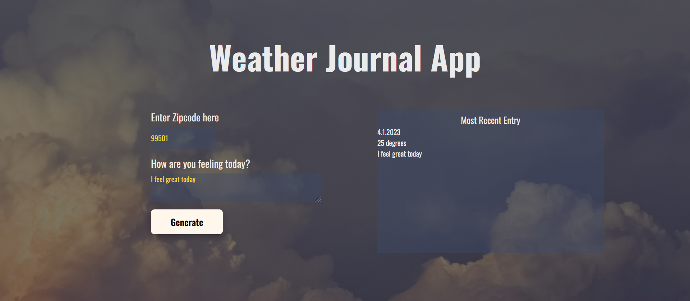

# Weather-Journal App Project

## Table of Contents

- [Project Title](#weather-journal-app-project)
- [Project Description](#project-description)
- [Dependencies](#dependencies)
- [Change in the Code](#change-in-the-code)
- [JS Version](#js-version)

## Project Description

This wep app is made to get the temprature with _celisus_ degree, name of city which is showing the temprature, date of today, status of the weather and the icon status behind the temprature using **ZIP** code and this will be execute when the user type a correct ZIP code in the input box and click on generate button
if the user not write any ZIP code, alert box will show in the browser to tell him/her to write a ZIP code and if write ZIP code false the alert box will show message "city not found"

## Dependencies

- Node.js
- Express
- Body-parser - Express middleware: to parse incoming request bodies
- Cors - Express middleware : for cross origin allowance

## Change in the Code

I changed on _HTML_ file and _CSS_ file to change the layout of the web app and adding installing the express, body-parser, cors and using them in _server.js_ file and write the code to execute what happen when clicking on the button in _app.js_ file

**_You can check what is changed from the commit page in this repo_**

### Port

Backend Server runs on port: 8000

## JS Version

ES6
